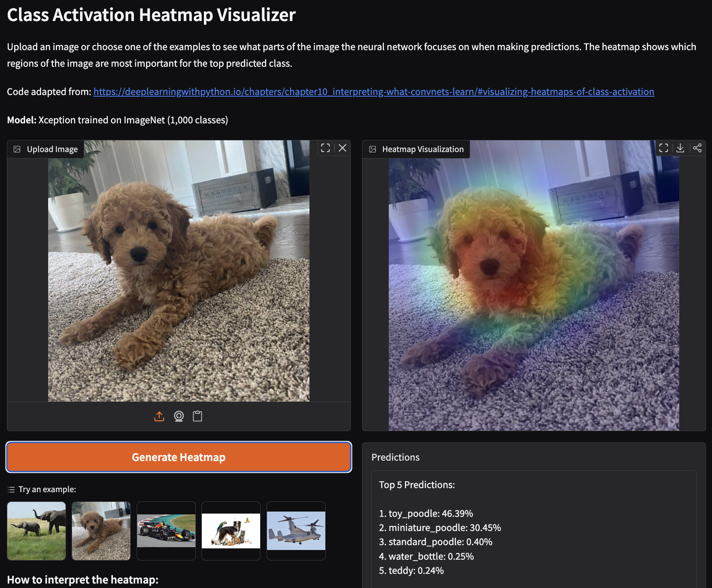

# CNN_Class_Activation_Heatmap_Visualizer
Hugging Face Space to display a heatmap of areas the CNN used for classification.

Code adapted from: https://deeplearningwithpython.io/chapters/chapter10_interpreting-what-convnets-learn/#visualizing-heatmaps-of-class-activation

Model Used: Xception trained on ImageNet (1,000 classes) https://www.kaggle.com/models/keras/xception/keras/xception_41_imagenet/2

